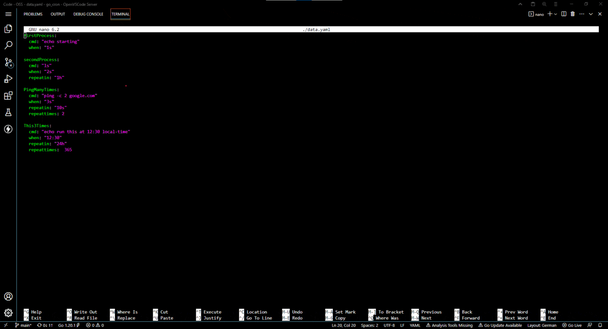

# automation tool for Linux, written in go
This is mostly practise I came up with, wanting to handle some concurrency in go.



## input for the shedule
- use the `--path` flag to pass in a `.yaml` file (default path is `./data.yaml`)
```yaml
processName1:
    cmd: "./somefile --with args"   #neccesary  - file-to-run --with optionalargs"
    when: "1h"                      #neccesary  - timestamp like "22:00" OR timeduration like "1h30m5s"
    repeatin: "10m"                 #optional   - intervall the process will repeat at, till it runs out of repeattimes
    repeattimes: 5                  #optional   - int how many (additional) reruns of the command
process2:
    # ...
```
- if optional parameters `repeatin` and `repeattimes` are omited, the process will only run once.
- if only `repeattimes` is omited, the process will repeat once. So it will run two times in total.
- each process will run in its own unique goroutine, thus multithreaded.
- once all processes have finished the go_automate will close.


## Limitations
- no way to time out processes that keep running. For example `ping google.com` will keep running and would only pass it's logging over once it finishes. But since it does not, no output is passed down.
    - https://www.sohamkamani.com/golang/exec-shell-command/ if i ever need something like that.
